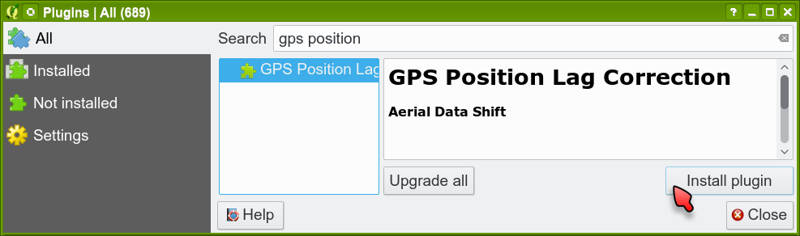
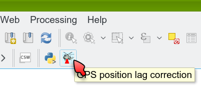

Installation
************

There are many ways to install the plugin. The easiest method is to
install it from the QGIS Plugin repository.

Firstly, you have to open the plugins dialog in QGIS.  Go to
:menuselection:`Plugins --> Manage and Install Plugins`:

.. figure:: images/install_001_plugins_menu.png

   Plugins menu.

Search for ``GPS Position Lag Correction`` plugin in the list on the
``All`` or ``Not installed`` tab.  Select the plugin and press the
``Install`` button.

   Search and install the plugin.
   
   and the plugin icon appears in the QGIS toolbar:

   Safecast plugin in QGIS toolbar.

and now the plugin is ready to use.
