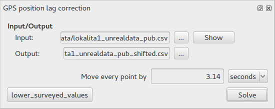
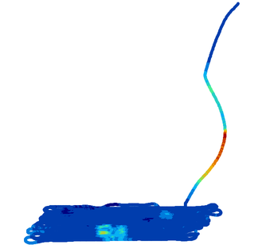
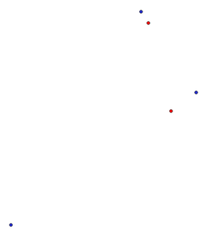

User Manual
***********

   Plugin GUI.

Input and output
----------------

As input, you have to define the file you want to work with. You can
write the path to this file manually or use the button with
``...``. By clicking on this button, you will get the dialog intended
to choose your file. Click on OK will insert this path to the basic
interface. Click on Cancel will interrupt the choosing dialog, and the
input path will not be changed.

The same procedure is with output, but there you define
the path where the new file will be created.
The choosing dialog for output is intended to
choose folder, not file.

::

   Input CSV contents
   lat_deg:    Latitude of point (EPSG:4326)
   lon_deg:    Longitude of point (EPS:4326)
   Gtm_sec:    Time stamp of measuring in seconds

There is also an optional possibility of styling your points
for better visualisation.

By default, you have not defined any style and points will be created
in the default QGIS style (on Style button is written ``No style``) If
you want your own style, you have to click on this button. You will
get the browsing dialog.  You are automatically directed to folder
``styles`` in the plugin folder; here you can choose qml file and
click OK. Click on Cancel interrupts the dialog and sets again ``No
style``.  If you choose your own style, you will see its name on the
style button.

In the default plugin version there are two presetted styles.  User is
allowed to import his own styles. Styling is based on the value in
column ``mereni``.

If user prefers to visualise both the input and the output from one
dialog, it is allowed by the ``Show`` button. Input layer is also
styled and it gives user the opportunity to compary the shifted values
with the original ones.

   Styled input.

Shift
-----

Shift is done by clicking on the button ``Solve``. User should define
value of shif and can choose units - values, meters (distance) or
seconds (variable distance considering current velocity). Points are
shifted on a trajectory.

   Red ones shifted by 1.14 seconds
